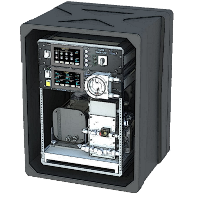

## Introduction

Welcome to the documentation of Oceanpack!

The [oceanpack](https://github.com/markusritschel/oceanpack) package is a collection of routines that help with the quality control and processing of data collected with the OceanPack ferrybox system of SubCtech.

```{note}
This is **not** an official package. The company SubCtech is not involved in the development of the routines provided here.
```

The OceanPack system measures underway CO2 alongside water temperature, salinity and other parameters.
Data are usually stored on an SD card but can also be streamed to a computer.
The routines in this package contain routines for conversion of xCO2 to pCO2, for applying temperature corrections, computing the fugacity, etc.

A full description of the functions and the underlying algorithms can be found in the Module Reference.

## Getting Started

### Installation

#### Install via pip

The easiest way to install the package is via pip directly from this repository:

```bash
$ pip install git+https://github.com/markusritschel/oceanpack.git
```

#### Clone repo and install locally

Alternatively, clone the repo and use the *Make* targets provided.
First, run

```bash
make conda-env
# or alternatively
make install-requirements
```

to install the required packages either via `conda` or `pip`, followed by

```bash
make src-available
```

to make the project's routines (located in `src`) available for import.

### Usage

The package can be imported and used as follows:

```python
import oceanpack
```

### Test code

You can run

```bash
make tests
```

to run the tests via `pytest`.

## Contact

For any questions or issues, please contact me via git@markusritschel.de or open an [issue](https://github.com/markusritschel/oceanpack/issues).
